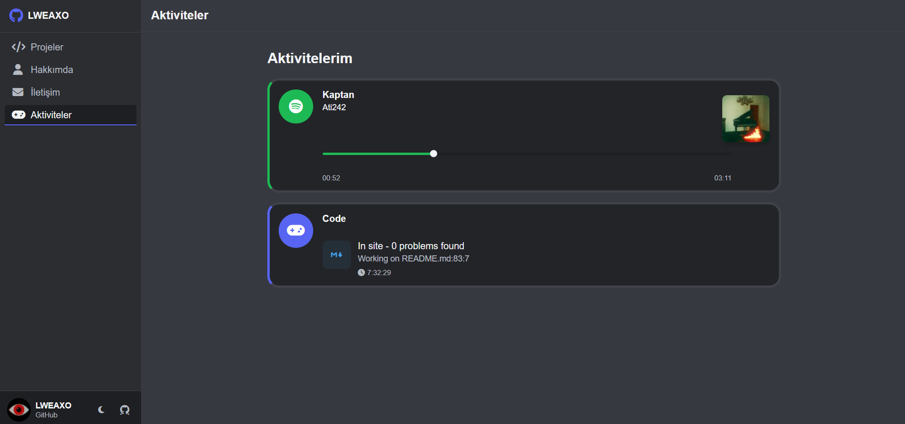

# 🌟 LWEAXO GitHub Profil Sayfası



## 📌 Proje Açıklaması
Modern ve interaktif bir GitHub profil sayfası oluşturmak için tasarlanmış bu proje, kullanıcı deneyimini ön planda tutarak geliştirilmiştir. Tamamen responsive yapıdadır ve dark/light tema desteği sunar.

## ✨ Öne Çıkan Özellikler

- 🎨 **Dark/Light Tema** Desteği
- 📱 **Tamamen Responsive** Tasarım
- 🚀 **GitHub API** Entegrasyonu
- 💬 **Sosyal Medya** Butonları
- 🎭 **Emoji Destekli** İnteraktif Butonlar
- 📊 **Dinamik Proje** Gösterimi

## 🛠️ Kurulum

1. Depoyu klonlayın:
```bash
git clone https://github.com/LWEAXO/github-profile.git
```

2. Proje dizinine gidin:
```bash
cd github-profile
```

3. Tarayıcınızda `index.html` dosyasını açın

## 🔧 Özelleştirme

1. `script.js` dosyasında kullanıcı adını değiştirin:
```javascript
const GITHUB_USERNAME = "LWEAXO"; // GitHub kullanıcı adınız
const DISCORD_USER_ID = "1015356240492245054"; // Discord ID'niz
```

2. İletişim bilgilerini güncelleyin:
```html
<span>LWEAXO</span> <!-- Burayı değiştirebilirsin-->

<button class="social-btn discord-btn" data-link="https://discord.com/users/1015356240492245054"> <!--Discord idniz ile değiştirin-->
        <i class="fab fa-discord"></i>
        <span>Discord</span>
</button>
    
<button class="social-btn discord-btn" data-link="https://discord.gg/codeium"> <!--discord sunucunuz ile değiştirin-->
        <i class="fab fa-discord"></i>
        <span>Discord Sunucumuz</span>
</button>
    
<button class="social-btn instagram-btn" data-link="https://www.instagram.com/lweaxo/"> <!-- instagram adresiniz ile dğeiştirin-->
        <i class="fab fa-instagram"></i>
        <span>Instagram</span>
</button>
    
<button class="social-btn github-btn" data-link="https://github.com/LWEAXO"> <!-- github hesabınız ile dğeiştirin -->
        <i class="fab fa-github"></i>
        <span>GitHub</span>
</button>
```

## 🎨 Tema Özelleştirme

`styles.css` dosyasından renk paletini değiştirebilirsiniz:

```css
:root {
  --primary-color: #5865F2; /* Discord mavisi */
  --secondary-color: #1DB954; /* Spotify yeşili */
  --text-color: #f0f0f0;
}
```

## 🌍 Canlı Önizleme

Projeyi canlı olarak [buradan](https://lweaxo.vercel.app/) görüntüleyebilirsiniz.

## Dikkat

- Sitedeki Aktiviteler kısmının çalışması için [Lanyard](https://discord.gg/lanyard)'ın discord sunucusuna katılmanız lazım.

## 🌟 Destek Olun

Bu projeyi beğendiyseniz, katkıda bulunmak için:

1. ⭐ **Star atarak** projeyi destekleyebilirsiniz  
2. 🌐 **Demo sitesini açık bırakarak** trafik oluşturabilirsiniz 

## 📜 Lisans

Bu proje MIT lisansı altında lisanslanmıştır - detaylar için [LICENSE](LICENSE) dosyasına bakın.

---

## 📞 İletişim

[](https://discord.com/users/1015356240492245054)
[](https://instagram.com/lweaxo)
---
